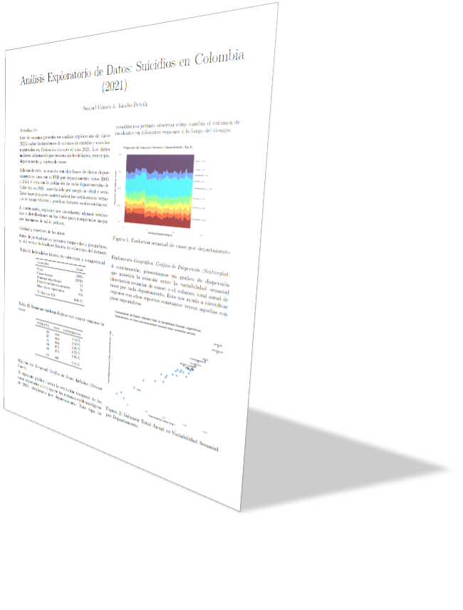
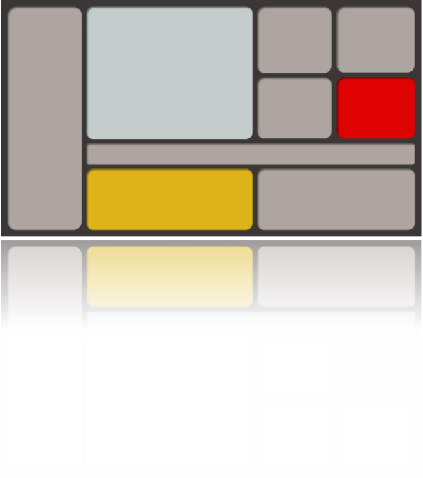

```{r setup, include=FALSE}
library(kableExtra)
library(dplyr)
```

# Fuentes de Información

Para el proyecto utilizamos tres bases de datos:

## Instituto Nacional de Salud (INS)

1.  [**`datos_suicidios_2021.csv`**](https://www.datos.gov.co/resource/fhc4-jjti.csv?$query=SELECT%0A%20%20%60cod_eve%60%2C%0A%20%20%60nombre_evento%60%2C%0A%20%20%60semana%60%2C%0A%20%20%60ano%60%2C%0A%20%20%60municipio_ocurrencia%60%2C%0A%20%20%60departamento_ocurrencia%60%2C%0A%20%20%60conteo%60%0AWHERE%20caseless_eq(%60nombre_evento%60%2C%20%22INTENTO%20DE%20SUICIDIO%22)): con la información de los intentos de suicidio registrados en cada semana del año 2021 en cada municipio del país. Información que hace parte del sistema SIVIGILA que mantiene el Instituto Nacional de Salud (INS) bajo la instrucción del MinSalud.

## Departamento Administrativo Nacional de Estadística (DANE)

2.  [**`PIB_departamental.csv`**](https://www.dane.gov.co/files/operaciones/PIB/anex-PIBDep-TotalDep-2024pr.xlsx): con los datos de aporte al PIB nacional de cada departamento del país en **miles de millones de pesos** desde el año 2005 hasta el 2024. *Para nuestro análisis solo utilizamos la información del año 2021.*

3.  [**`población_departamentos_2021.csv`**](https://www.dane.gov.co/files/censo2018/proyecciones-de-poblacion/Departamental/PPED-AreaDep-2018-2050_VP.xlsx): con los datos de proyecciones de población del DANE para cada departamento del país, utilizando como base el censo de 2018.

# Justificación

El estudio de la conducta suicida en Colombia se justifica por su impacto devastador y su creciente prevalencia como problema de salud pública.

**¿Por qué es necesario abordar este tema?**: Principalmente porque el **intento de suicidio es el predictor más fuerte** de un futuro suicidio consumado. Identificar a las personas en riesgo y proporcionarles seguimiento es un componente clave para salvar vidas. Además, estas conductas generan una **gran carga social y económica** debido al uso intensivo de servicios de salud y al impacto emocional en las comunidades.

El tema es crítico hoy en día debido a que las tasas de suicidio han aumentado un 60% a nivel mundial en las últimas décadas. En Colombia, los intentos de suicidio registraron un **incremento del 25% en 2022** frente a 2021. Asimismo, la **pandemia de COVID-19** dejó secuelas significativas, aumentando el riesgo de trastornos mentales como depresión y ansiedad. La pertinencia del tema se refleja en la reciente aprobación de la **Ley 2460 de 2025**, que busca reformar el sistema hacia una atención más humana y comunitaria ante la crisis actual.

# Caracterización

**¿Quién es el INS?**: El **Instituto Nacional de Salud (INS)** es la autoridad técnica encargada de la **vigilancia y el análisis del riesgo en salud pública** en el país. Es la entidad responsable de elaborar los protocolos de vigilancia y procesar la información estadística para orientar las políticas de prevención.

**¿Qué es el SIVIGILA?**: Es el **Sistema de Vigilancia en Salud Pública**, una herramienta operativa y estadística que permite la recolección, procesamiento y análisis de datos sobre eventos de interés en salud pública, como el intento de suicidio. Su objetivo es detectar cambios en los patrones de ocurrencia de estos eventos para generar acciones de control oportunas.

# Usuarios de la Visualización

Las personas a quienes está dirigida la visualización son aquellas que supervisan el SIVIGILA, es decir, **médicos epidemiólogos con un perfil muy técnico** en el campo de la salud. Para ellos, la implementación de un **tablero de control dinámico (*dashboard*)** para la vigilancia del **evento 356 (intento de suicidio)** en el sistema SIVIGILA no es solo una mejora tecnológica, sino una necesidad estratégica para transformar la gestión de la salud mental en Colombia. Actualmente, los encargados de orientar la política pública y los directivos de entes como el **Instituto Nacional de Salud (INS)** y las secretarías territoriales dependen de **archivos planos**: PDF's, fichas de notificación física y reportes con periodicidad mensual o semestral para analizar la situación. Esta forma de procesar la información, centrada en la revisión manual de datos estadísticos descriptivos, resulta insuficiente frente a un fenómeno que requiere una **respuesta inmediata**, dado que el intento de suicidio es el predictor más fuerte de una muerte consumada.

Para quienes lideran la **Dirección de Vigilancia y Análisis del Riesgo**, un tablero de control ofrece una ventaja comparativa crítica sobre los métodos tradicionales. Mientras que hoy deben esperar el cierre de periodos epidemiológicos para consolidar indicadores de impacto, una visualización técnica permitiría **detectar oportunamente cambios en los patrones de ocurrencia** y clústeres geográficos en tiempo real.

Además, el perfil técnico de los profesionales que estudian el SIVIGILA se beneficiaría de la **interoperabilidad** que propone un dashboard. Actualmente, la información está fragmentada entre los reportes de las **UPGD**[^1], la línea nacional de toxicología y los datos forenses.

[^1]: Unidades Primarias Generadoras de Datos

Sustituir los reportes estáticos por una herramienta visual e interactiva dota a los coordinadores de salud pública de la capacidad de pasar de una actitud reactiva a una **estrategia de prevención proactiva**. La visualización de datos no solo simplifica la complejidad del código 356, sino que humaniza la estadística al permitir un **seguimiento a largo plazo** de los casos reincidentes, garantizando que la vigilancia se convierta realmente en una **orientación para la acción** que salve vidas.

# Análisis de Datos Exploratorio

El EDA se encuentra en otro documento aparte como un informe en formato IEEE el cuál puede ser consultado en el [repositorio de GitHub](https://github.com/Samuel2165/Visualizacion_2026_10) como el archivo [eda_suicidios.pdf](https://github.com/Samuel2165/Visualizacion_2026_10/blob/main/eda_suicidios.pdf).

{width="100%"}

# Contenido de las Bases de Datos

A continuación, se listan los atributos de las bases de datos, especificando el contenido de cada columna.

## Población

`población_departamentos_2021.csv`

Esta tabla muestra las columnas de la base de datos con su descripción y tipo de variable:

```{r}
data.frame(
  Columna = c("dp", "dpnom", "ano"),
  Descripción = c("Código del departamento", "Nombre del departamento", "Año en el que se realizó el conteo"),
  Tipo = c("Categórico", "Categórico", "Categórico")
) |>
  mutate(Columna = cell_spec(Columna, format = "latex", monospace = TRUE)) |>
  kable(format = "latex", booktabs = TRUE, linesep = "", escape = FALSE) |>
  kable_styling(latex_options = c("striped", "hold_position", "scale_down"), font_size = 8)
```

## Cantidad de Suicidios

`datos_suicidios_2021.csv`

Esta tabla muestra las columnas de la base de datos con su descripción y tipo de variable:

```{r}
data.frame(
  Columna = c("cod_eve", "nombre_evento", "semana", "ano", "municipio_ocurrrencia", "departamento_ocurrencia", "conteo"),
  Descripción = c("Código del evento", "Nombre del evento", "Semana en la que ocurrió el evento (1-52)", "Año en el que ocurrió el evento", "Municipio en el que ocurrió el evento", "Departamento en el que ocurrió el evento", "Conteo de casos"),
  Tipo = c("Categórico", "Categórico", "Ordinal", "Categórico", "Categórico", "Categórico", "Cuantitativo")
) |>
  mutate(Columna = cell_spec(Columna, format = "latex", monospace = TRUE)) |>
  kable(format = "latex", booktabs = TRUE, linesep = "", escape = FALSE) |>
  kable_styling(latex_options = c("striped", "hold_position", "scale_down"), font_size = 7)
```

## PIB Departamental

`PIB_departamental.csv`

Esta tabla muestra las columnas de la base de datos con su descripción y tipo de variable:

```{r}
data.frame(
  Columna = c("codigo_departamento_divipola", "departamentos", "X2021"),
  Descripción = c("Código del departamento", "Código del departamento", "Nombre del departamento"),
  Tipo = c("Cualitativo", "Cualitativo", "Cualitativo")
) |>
  mutate(Columna = cell_spec(Columna, format = "latex", monospace = TRUE)) |>
  kable(format = "latex", booktabs = TRUE, linesep = "", escape = FALSE) |>
  kable_styling(latex_options = c("striped", "hold_position", "scale_down"), font_size = 8)
```

# Objetivo General

El objetivo general del proyecto es:

> *Diseñar un tablero de control interactivo que visualice la tasa de incidencia de intentos de suicidio (Evento 356) por departamento en Colombia, integrando variables sociodemográficas y determinantes socioeconómicos para identificar clústeres de riesgo y orientar la toma de decisiones estratégicas en salud pública territorial.*

# Objetivos Específicos

1. **Describir** la distribución de las tasas de incidencia de intentos de suicidio (Evento 356) por departamento y municipio durante las 52 semanas epidemiológicas del 2021, mediante visualizaciones de series de tiempo y mapas coropléticos.
2. **Comparar** la proporción de casos de intentos de suicidio entre los distintos departamentos de Colombia, utilizando métricas normalizadas por cada 100.000 habitantes para identificar disparidades regionales.
3. **Correlacionar** el volumen de intentos de suicidio reportados con el PIB departamental per cápita, empleando gráficos de dispersión para explorar posibles asociaciones macroeconómicas.
4. **Detectar** agrupamientos (clústeres) y valores atípicos (outliers) en los picos de incidencia semanal, facilitando la identificación visual de departamentos con alertas epidemiológicas inusuales a lo largo del año.
5. **Clasificar** los departamentos del país según su nivel de riesgo epidemiológico (bajo, medio, alto) basándose en la concentración de casos y factores de vulnerabilidad, presentándolo a través de matrices de riesgo o *heatmaps*.

# Plantilla Dashboard

Hay muchas opciones para crear un tablero de control, generalmente este cambia a medida que aparecen más medidas que se desean visualizar o nuevas formas de agrupar las visualizaciones.

```{r}
colors_hex <- c("#C4CBCB", "#AEA4A2", "#dcb318", "#DE0202")

data.frame(
  Color = c("Gris", "Gris azulado", "Amarillo", "Rojo"),
  `Código HEX` = colors_hex,
  check.names = FALSE
) |>
  mutate(`Código HEX` = cell_spec(`Código HEX`, 
                                  format = "latex",
                                  background = `Código HEX`,
                                  color = ifelse(`Código HEX` %in% c("#DCB318", "#C4CBCB"), "black", "white"))) |>
  kable(format = "latex", booktabs = TRUE, linesep = "", escape = FALSE) |>
  kable_styling(latex_options = c("hold_position", "scale_down"), font_size = 9)
```

Como **paleta de colores** tenemos los mismos que se utilizan en este documento.

Además de compartir las fuentes: \ralewayfont Raleway\normalfont, \georgiafont Georgia \normalfont y `Courier New`  para la identidad visual.

Este diseño, inspirado en las pinturas de Mondrian puede ser una plantilla para 4 **KPI's** en la parte lateral derecha, uno de ellos siendo crítico para monitorear en rojo (por ejemplo, casos totales y su variación semanal), un espacio a la izquierda tipo ***sidebar*** para manejar todos los filtros, algunos espacios anchos en la parte inferior para **gráficos de líneas o barras** y un espacio amplio para un **mapa**.

Variaciones de este diseño harán el tablero final.

{width="100%"}